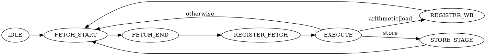

# Registers

**PC**: Program counter

**R0-R14**: General purpose registers

**R15**: Used by load and store as the highest 8 bits of a 16 bit memory address


# Instructions

**mov rd, #imm**

Move an 8 bit immediate into register R<sub>d</sub>

**load rd, @mem**

Load register R<sub>d</sub> with the memory contents at address @mem

[NOTE] Mention R15

**store @mem, rs**

Store the contents of register R<sub>s</sub> at memory address @mem

[NOTE] Mention R15

**add rd, ra, rb**

**add rd, imm**

**sub rd, ra, rb**

**sub rd, imm**

**jnz**

**jz**

**jmp**

**int**

**nop**


# Instruction encoding

|   inst     | opcode | op1 | op2 | op3 |       packing       |
|------------|--------|-----|-----|-----|---------------------|
|mov r, i8   |  0000  | 4x  | 8x  | --  | ```0000 rrrr #### ####``` | 
|load r, m   |  0010  | 4x  | 8x  | --  | ```0010 rrrr @@@@ @@@@``` |
|store m, r  |  0011  | 8x  | 4x  | --  | ```0011 rrrr @@@@ @@@@``` |
|add r, r, r |  0100  | 4x  | 4x  | 4x  | ```0100 rrrr rrrr rrrr``` |
|add r, i8   |  0101  | 4x  | 8x  | --  | ```0101 rrrr #### ####``` |
|sub r, r, r |  0110  | 4x  | 4x  | 4x  | ```0110 rrrr rrrr rrrr``` |
|sub r, i8   |  0111  | 4x  | 8x  | --  | ```0111 rrrr #### ####``` |
|jnz  i8     |  1000  | 8x  | --  | --  | ```1000 0000 @@@@ @@@@``` |
|jz  r       |  1001  | 4x  | --  | --  | ```1001 rrrr 0000 0000``` |
|jmp r,r     |  1010  | 4x  | 4x  | --  | ```1010 rrrr rrrr 0000``` |
|cli         |  1011  | --  | --  | --  | ```1011 0000 0000 0000``` |
|sti         |  1100  | --  | --  | --  | ```1100 0000 0000 0000``` |
|reti        |  1101  | --  | --  | --  | ```1101 0000 0000 0000``` |
|nop         |  1111  | --  | --  | --  | ```1111 0000 0000 0000``` |

Memory accesses use 16 bit addresses. r15 is the implicit register that contains 
the high 8 bits of the address. The program counter is now 16 bit wide. The jmp 
instruction can be used to perform jumps to 16 bit addresses.

# Instruction execution



# Memory layout

| Range | Content |
|-------|---------|
| 0000-00FF | Boot code |
| 0100-01FF | Interrupt table|  

Perhaps 8 interrupts are enough? I don't think we'll ever need more than 8.


# Interrupt mechanism

- There is one interrupt line that can be used by the UART (for now, other peripherals in the future) to signal that data is ready.

- We need a mechanism to enable and disable interrupts
    - CLI, STI?

- How do we signal the start and end of interrupt processing?
    * The start is signaled by a jump to the interrupt service routine
    * The execution of the original code is resumed with a RETI, which extracts the saved registers from somewhere and sets the program counter to the location where the interrupt happened

- Should we support nested interrupts?
    - Not for now. Let's try to get this mechanism working to be able to program the firmware through UART.


